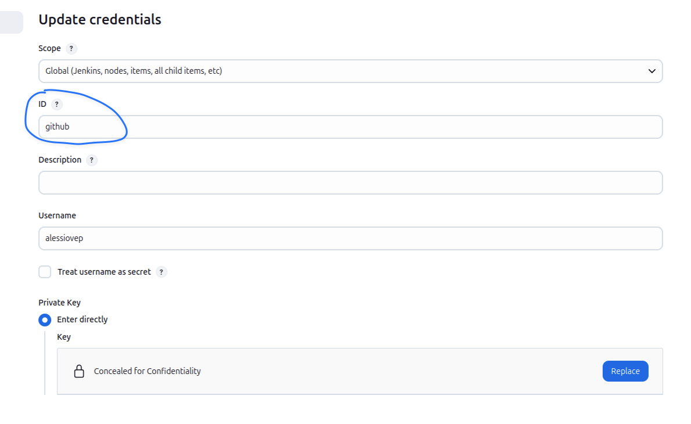
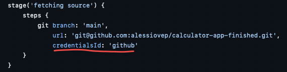
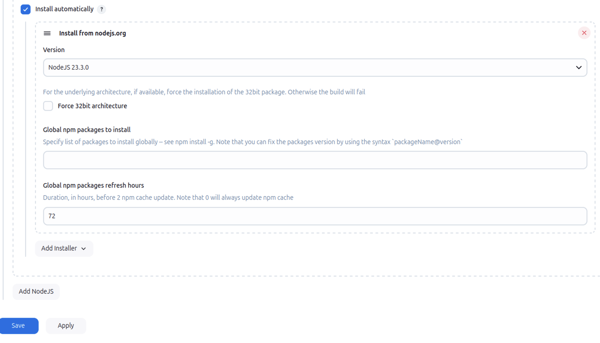
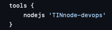
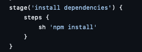
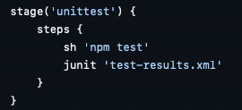
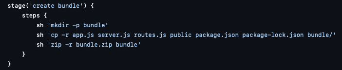
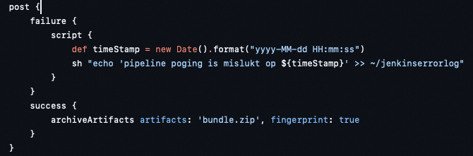
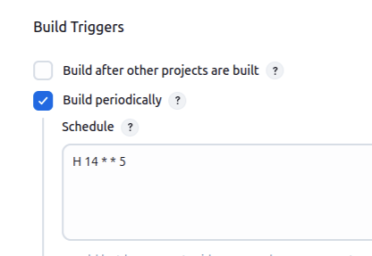

Vul onderstaande aan met de antwoorden op de vragen uit de readme.md file. Wil je de oplossingen file van opmaak voorzien? Gebruik dan [deze link](https://github.com/adam-p/markdown-here/wiki/Markdown-Cheatsheet) om informatie te krijgen over
opmaak met Markdown.

a)

## 1. Aanmaken van credentials
- Ga naar Manage Jenkins, Credentials, System, Global Credentials, Add Credentials;
- Vervolgens klikken op SSH Usenrame with private key (kind), id heb ik 'github' genoemd, username 'alessiovep';
- Tenslotte klikken op 'enter directly' (private key), add, toevoegen van de private key.

## 2. Credentials in de Jenkensfile
- De Jenkinsfile aanpassen waar verwezen wordt naar de credentialsId 'github', => zie stap 1 waar ik de id 'github' heb genoemd.

## screenshot Credential Manager

b)

## 1. Installeren van de plugin
- Ga naar Manage Jenkins, Plugins, Available plugins en zoeken op NodeJS;
- Vervolgens de plugin selecteren/aanvinken en rechts klikken op 'install'.

## 2. Tool installation
- Ga naar Manage Jenkins, Tools, naar beneden scrollen en klikken op 'Add nodejs', vervolgens naam invullen en saven.

## 3. Plugin gebruiken dat we hebben ingesteld in de Jenkensfile
- De NodeJS-versie wordt geladen

## 4. Test plugin in de Jenkensfile
- De pipeline in die zin aanpassen dat we de versie van JS en npm opvragen, hiermee testen we of het werkt.

  
c)

## 1. Stage: install dependencies
- installeert alle npm dependencies met 'npm install'.

## 2. Stage: unittest
- Voert unittests uit en genereert een junit-rapport.

## 3. Stage: create bundle
- Maakt een map 'bundle' met de nodige bestanden en maakt een zip-bestand.

## 4. Stage: error handling en artifacts
- Bij falen schrijft de pipeline een error met datum en tijd naar 'jenkinserrorlog'

d)

## Automatisch draaien van de pipeline
- Om de pipeline elke vrijdag om 14u00 te draaien, hebben we een cron trigger toegevoegd via de Jenkins interface.

### Stappen:
- Ga naar de configure pagina van de pipeline in Jenkins;
- Onder 'Build Triggers', vink 'Build periodically aan;
- Vul het cron schema aan met => H 14 * * 5 en tenslotte op 'save' klikken.

